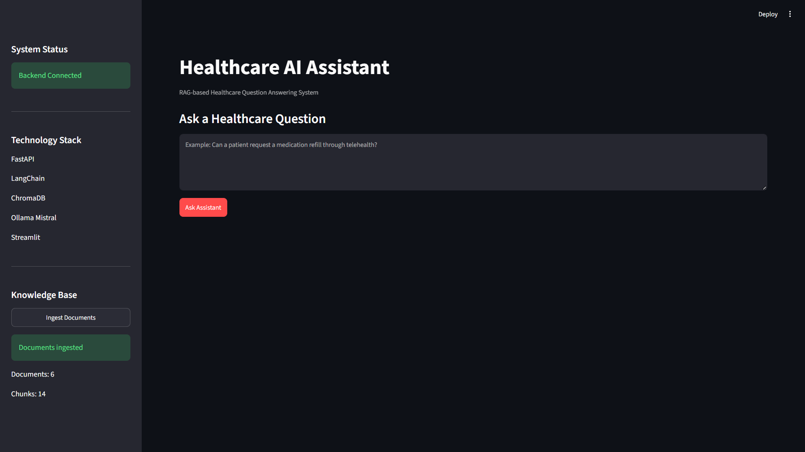
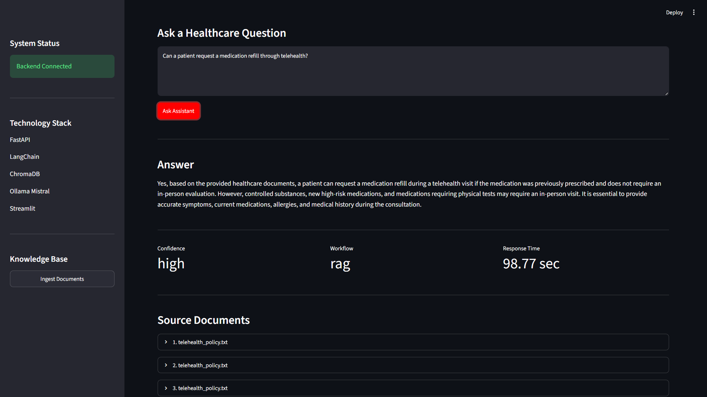
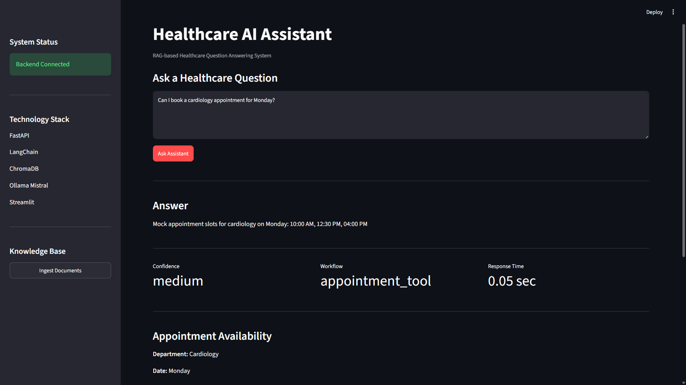
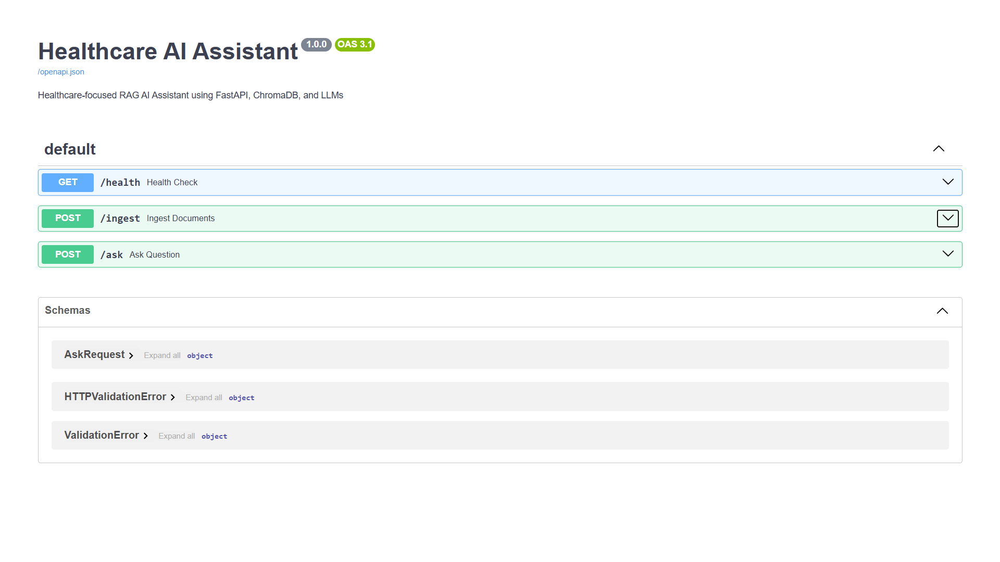

# 🏥 Healthcare AI Assistant Using RAG and LLMs

## Overview

This project is a healthcare-focused AI assistant developed as part of an **AI Engineer Hackathon Assignment**.

The application uses a **Retrieval-Augmented Generation (RAG)** pipeline to answer healthcare-related questions using a healthcare knowledge base. Instead of relying only on the language model, it retrieves relevant information from indexed documents and generates responses based on the retrieved context.

To demonstrate a simple agentic workflow, appointment-related queries are routed to a mock appointment scheduling tool, while document-related questions are answered using the RAG pipeline.

The project runs locally using **Ollama with the Mistral model**, allowing it to work completely offline without depending on external LLM APIs.

---

# Screenshots

## Home Page



---

## RAG Response



---

## Appointment Tool



---

## Swagger API



---

# Features

* Retrieval-Augmented Generation (RAG)
* Healthcare knowledge base using synthetic documents
* Local LLM with Ollama (Mistral)
* ChromaDB for vector storage
* HuggingFace sentence embeddings
* Source citations with every response
* Mock appointment scheduling tool
* FastAPI REST API
* Streamlit web interface
* Docker support
* Environment-based configuration

---

# Tech Stack

| Component       | Technology                             |
| --------------- | -------------------------------------- |
| Backend         | FastAPI                                |
| Frontend        | Streamlit                              |
| LLM             | Ollama + Mistral                       |
| Embeddings      | sentence-transformers/all-MiniLM-L6-v2 |
| Vector Database | ChromaDB                               |
| Framework       | LangChain                              |
| Language        | Python                                 |
| Deployment      | Docker                                 |

---

# Project Workflow

The application follows a simple Retrieval-Augmented Generation (RAG) workflow.

1. Healthcare documents are loaded from the **data** folder.
2. Documents are split into smaller chunks.
3. Each chunk is converted into vector embeddings.
4. Embeddings are stored in ChromaDB.
5. When a user asks a question, the most relevant document chunks are retrieved.
6. The retrieved context is passed to the local Mistral model.
7. The assistant generates a grounded response and returns the supporting source documents.

For appointment-related questions, the request is routed directly to the mock appointment scheduling tool.

---

# Project Structure

```text
healthcare-ai-assistant/

├── app/
│   ├── main.py
│   ├── rag.py
│   ├── llm.py
│   ├── embeddings.py
│   ├── agent.py
│   ├── tools.py
│   ├── config.py
│   ├── prompt.py
│   └── logger.py
│
├── data/
├── screenshots/
├── tests/
├── logs/
├── vector_store/
│
├── streamlit_app.py
├── requirements.txt
├── Dockerfile
├── docker-compose.yml
├── README.md
└── .env.example
```

---

# Dataset

The knowledge base contains six synthetic healthcare documents covering:

* Telehealth Consultation Guidelines
* Medication Refill Policy
* HIPAA Privacy Guidelines
* Appointment Scheduling Policy
* Insurance Eligibility FAQ
* Patient Discharge Instructions

This project uses only sample healthcare documents. No real patient information or protected health information (PHI) is included.

---

# API Endpoints

## Health Check

```http
GET /health
```

Returns the current status of the application.

---

## Document Ingestion

```http
POST /ingest
```

Loads healthcare documents, generates embeddings, and stores them in ChromaDB.

---

## Ask a Question

```http
POST /ask
```

### Example Request

```json
{
    "question": "Can a patient request a medication refill through telehealth?"
}
```

### Example Response

```json
{
    "answer": "Yes, patients can request medication refills through telehealth if the medication was previously prescribed.",
    "confidence": "high",
    "workflow": "rag",
    "sources": [
        {
            "document": "telehealth_policy.txt"
        }
    ]
}
```

---

# Sample Questions

## RAG Questions

* Can a patient request a medication refill through telehealth?
* What information is considered protected health information?
* When should a patient seek emergency medical care?
* What documents are required for insurance eligibility?

## Appointment Tool Questions

* Can I book a cardiology appointment for Monday?
* Show available dermatology slots.
* Schedule a pediatrics appointment.

---

# Running the Project

## Clone the Repository

```bash
git clone https://github.com/Akash-connect/Healthcare-AI-Assistant-Using-RAG-and-LLMs.git
```

## Create a Virtual Environment

```bash
python -m venv venv
```

## Activate the Environment

### Windows

```bash
venv\Scripts\activate
```

### Linux / macOS

```bash
source venv/bin/activate
```

## Install Dependencies

```bash
pip install -r requirements.txt
```

## Start Ollama

```bash
ollama run mistral
```

## Run FastAPI

```bash
uvicorn app.main:app --reload
```

## Open Swagger

```text
http://127.0.0.1:8000/docs
```

## Run Streamlit

```bash
streamlit run streamlit_app.py
```

---

# Docker

## Build the Docker Image

```bash
docker compose build
```

## Run the Application

```bash
docker compose up
```

---

# Future Improvements

* Support PDF document ingestion
* Add conversation memory
* Integrate a real appointment scheduling API
* Add user authentication
* Deploy to cloud platforms
* Support multiple languages

---

# Author

**Akash Jadhav**

AI Engineer | Artificial Intelligence & Data Science

This project demonstrates a practical implementation of Retrieval-Augmented Generation (RAG), local LLM inference using Ollama, vector search with ChromaDB, and a simple agent-based workflow for healthcare question answering.
